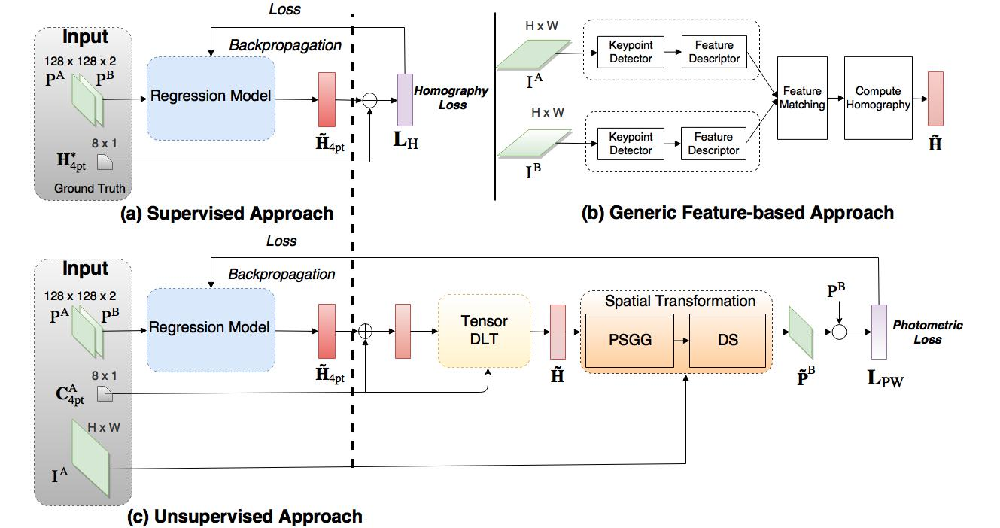

# Unsupervised Deep Homography - *Unoffical* PyTorch Implementation

[**Unsupervised Deep Homography: A Fast and Robust Homography Estimation
Model**](https://arxiv.org/abs/1709.03966)<br>
Ty Nguyen, Steven W. Chen, Shreyas S. Shivakumar, Camillo J. Taylor, Vijay
Kumar<br>



*Figure from original paper. Proposed model is \(c\)*

## Implementation Details

This implementation leverages [kornia](https://github.com/kornia/kornia), an
open source differentiable computer vision library. Kornia is used for computing
the direct linear transform (DLT) as well as the spatial transformation.

Uses [PyTorch Lighting](https://pytorch-lightning.readthedocs.io/en/latest/) for
easy GPU training and reproducibility.

`model.py`: Regression model implementation <br>
`dataset.py`: Synthetic data generator <br>
`train.py`: Train unsupervised model using photometric loss outlined in paper


### Training

**Note: tested on PyTorch version 1.4.0; previous versions have a bug that cause
`torch.inverse() and torch.solve()` to generate runtime errors.**

The model can be trained using synthetic data, created from the
[COCO](http://cocodataset.org/) dataset. 

```bash
python train.py path/to/COCO/train/ path/to/COCO/valid/
```
